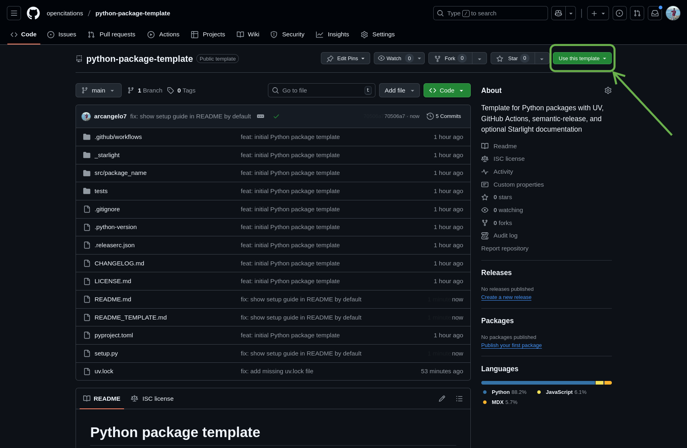
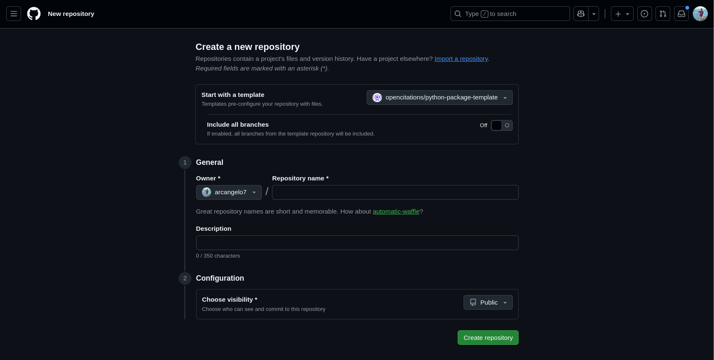

# Python package template

A template for creating Python packages with UV dependency management, pytest testing, semantic-release versioning, and optional Astro Starlight documentation.

## Getting started

1. Click the **Use this template** button on GitHub:

   

2. Select **Create a new repository**, fill in the repository name, and click **Create repository**:

   

3. Clone your new repository and continue with the setup below.

## Prerequisites

- **UV**: Install from https://docs.astral.sh/uv/getting-started/installation/
- **Python 3.10+**: UV can install Python for you with `uv python install`
- **Node.js and npm** (only for documentation site): Install from https://nodejs.org/en/download

## Setup

Run the setup script:

```bash
python setup.py
```

The script will ask for:
- Package name
- Description
- Author name and email
- GitHub username/organization
- Whether to include a Starlight documentation site

It will automatically configure all files and remove itself when done.

## After running the script

Configure your GitHub repository:

1. **Add PyPI token** (for publishing releases)
   - Create a token at https://pypi.org/manage/account/token/
   - Go to Settings > Secrets and variables > Actions
   - Add a new secret named `PYPI_TOKEN`

2. **Enable GitHub Pages** (only if you included documentation)
   - Go to Settings > Pages
   - Set Source to "GitHub Actions"
